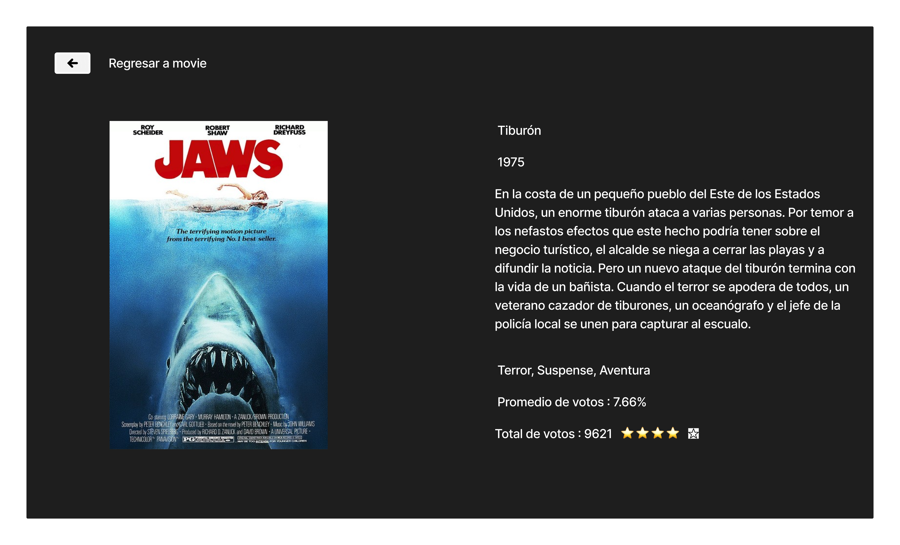

# Movie-Challenge-fw React + TypeScript + Vite   

El proyecto trata de consumir la data de endpoint/discover/movie, para poder filtrar y ordenar, manejo de la libreria React y el lenguaje de programación que se basa en js y que el codigo sea mas escalable, sencillo y facil de mantener.

Lo primero que hize fue leer el readme, cree un nuevo proyecto de react usando vite y Typescript, lo subi a github, cree la cuenta para obtener la API key y en base a mis tres historias de usuarios maquete mi proyecto.

Historia de usuario (1): 
Yo como usuaria quiero visualizar en un tabla (filas y columnas) el catálogo de películas

Criterios de aceptación
Se debe usar el endpoint /discover/movie.
La aplicación cuenta con una paginación para explorar el catálogo por páginas.
Para cada película se debe mostrar como mínimo: poster, título original y año de lanzamiento.
Definición de terminado
Los componentes desarrollados deben contar con test unitarios.

Historia de usuario (2):
Yo como usuaria quiero filtrar y ordenar el catálogo de películas usando los criterios soportados por TheMovie Database API V3

Criterios de aceptación
Para filtrar se debe usar el endpoint /discover/movie, y alguno de sus parámetros como por ejemplo with_genres.
Para ordenar se debe usar el endpoint /discover/movie, y alguno de sus parámetros como por ejemplo sort_by.
La paginación debe conservar el filtro y ordenamiento
Para cada película se debe mostrar como mínimo: poster, título original y año de lanzamiento.
Definición de terminado
Los componentes desarrollados deben contar con test unitarios.

Historia de usuario (3):
Yo como usuaria quiero consultar los detalles de una película

Criterios de aceptación
Se debe usar el endpoint /movie/{movie_id}.
Para la película se debe mostrar como mínimo: poster, título original, año de lanzamiento, géneros, promedio de votación y total de votos.
La interfaz debe permitir retornar al listado de películas conservando el filtro y ordenamiento.
Definición de terminado
Los componentes desarrollados deben contar con test unitarios.

Aqui va mi prototipo de alta fidelidad:

Despues de terminar mis funcionalidades que me estaba pidiendo el readme, desplegue mi proyecto en:
Netlify.

